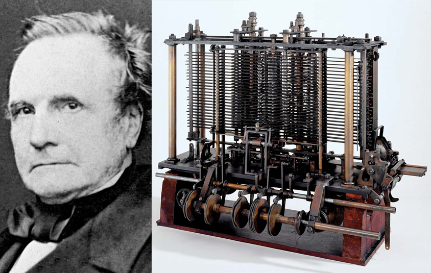

## Breve historia de las computadoras

La historia de la computación es bastante particular. A simple vista, se podría creer que serie de sucesos estrictamente ligada al siglo XX. Sin embargo, sus orígenes beben de descubrimientos mucho más tempranos que algunas veces ni siquiera tienen relación directa con la computación. Basta con ver que la primera mención de la palabra “computadora” data de 1613, cuando **Richard Braithwaite** publica su libro _The Yong Mans Gleanings_, en donde usa el anterior término para referirse a aquellos diestros en la aritmética.

Si bien es cierto que existen aparatos sumamente antiguos capaces de realizar operaciones matemáticas (tal es el caso del _“step reckonet”_ de Gottfried Leibniz o la pascalina de Blaise Pascal), los historiadores consideran la máquina analítica como la primera computadora de la historia, pese a que su inventor, **Charles Babbage**, no logró construir una versión funcional por las limitaciones tecnológicas de la época y algunos motivos políticos. La máquina analítica introduce por primera vez la idea de herramienta de propósitos generales, característica principal de toda computadora. Esto se lograba a través de instrucciones escritas en tarjetas perforadas, un recurso ideado por **Joseph Marie Jacquard** en el siglo XVII para sus telares.



El siguiente paso en la historia de la computación es realizado por **Herman Hollerith**, un inventor que desarrolló un tabulador electromagnético de tarjetas perforadas para ayudar en el censo estadounidense de 1890. Su máquina tabuladora mezclaba componentes tanto mecánicos como electrónicos para analizar tarjetas perforadas basadas en la lógica de Boole, la cual pasó a ser una constante en los futuros avances computacionales. 

Durante los próximos años, el mundo vería la aparición de numerosas computadoras electro-mecánicas, cada una más poderosa (y grande) que la anterior. Sin duda, una de las más llamativas y reseñables es la **Harvard Mark I**, diseñada para ayudar a los aliados durante la Segunda Guerra Mundial, teniendo a su vez un papel vital dentro del Proyecto Manhattan. Funcionaba por medio de chasquidos de relés (cincuenta por segundo, para ser precisos), los cuales tendían a dañarse debido a su uso constante. 

Los inconvenientes de los relés llevaron a varios ingenieros a buscar una nueva alternativa, la cual fue encontrada en los tubos de vacío, piezas frágiles pero duraderas y rápidas. El primer uso a gran escala de este recurso fue la elaboración del **Colossus Mark I**, diseñada por el ingeniero **Tommy Flowers** en 1943 y que pasó a ser la primera computadora enteramente electrónica programable. Tres años después, **John Presper Eckert** y **John William Mauchly**, con ayuda de la Universidad de Pensilvania, crearon el proyecto **ENIAC** (Electronic Numerical Integrator And Computer), la primera computadora electrónica totalmente programable y de propósito general.

La década de 1950 trajo consigo un sustituto a los delicados tubos de vacío: el transistor, de pequeño tamaño, gran velocidad y notable durabilidad. Sus ventajas incluso permitieron la creación de la IBM 608, la primera computadora comercialmente disponible. Este avance fue detonante de una revolución: no sólo los transistores se hacían cada vez más pequeños, sino también las computadoras.

Con el pasar de los años, las computadoras tomaron aun más terrenos. Seguían siendo usadas por las grandes universidades y gobiernos, pero también por todo tipo de compañías e incluso público general. Asimismo, el tamaño y portabilidad de esta tecnología mejoró al punto de ofrecernos laptops, smartphones y muchos otros artefactos multitareas.

## El origen de la programación

Las labores mecánicas siempre han sido duras. Por lo general, son tediosas, extensas y requiere de constante atención si no desea cometer un error en algún punto del proceso. No obstante, son un elemento constante en nuestras vidas. ¿Cómo podríamos asegurar la calidad de un producto o servicio sin un “recetario” o manual de instrucciones? Si se halla una solución eficaz a un problema, lo normal es recurrir a ella siempre que se pueda.

Por lo anterior, la necesidad de máquinas programables precede incluso a la aparición de las computadoras. Como se mencionó con anterioridad, ya para 1801 se conocían las tarjetas perforadas gracias a los telares automáticos de **Joseph Marie Jacquard**. Estos nuevos telares facilitaban la complicada labor de tejer telas con patrones, dando como lugar la disminución de costo de aquellas ropas que lucían este tipo de diseño. Sin embargo, las primeras computadoras no utilizaron las tarjetas perforadas para programar, sino generalmente para almacenar datos.

En las primeras décadas del siglo XX, si se deseaba programar una serie de pasos en una computadora, era necesario hacer uso de un panel de control compuesto de numerosos enchufes. Para activar ciertas partes de la máquina, se conectaban cables a estos enchufes para enviar una señal. Este tipo de tecnología era conocida como _Plugboard_ o tablero de conexiones.

Desafortunadamente, este método requería modificaciones considerables al tablero de conexiones para correr cada programa. La tarea era tan ardua que pronto se empezaron a crear plugboards intercambiables, cada uno orientado a realizar una tarea diferente. Aun así, la tarea de programar estos tableros era bastante compleja, por lo que pronto se buscó una nueva solución.

Entre la década de los 40’s y 50’s, se empezaron a desarrollar estudios que permitieron la creación de memorias electrónicas, lo cual llevo a las computadoras de la época a almacenar sus programas (y datos) en memorias internas. Estas ideas serían consolidadas en el **Modelo de Von Neumann**, una arquitectura de computadoras descrita por **John von Neumann** y que consta de una unidad de procesamiento, una unidad de control, una memoria, almacenamiento masivo externo y mecanismos de entrada y salida. La primera computadora en seguir este modelo fue construida en 1948 por la Universidad de Manchester, y tenía el apodo de **“Baby”**.

Ante esta nueva tecnología, los ingenieros y científicos se plantearon una nueva pregunta: ¿cómo se cargaría los programas en estas nuevas computadoras? Curiosamente, la respuesta la encontraron en el pasado: las antiguas tarjetas perforadas de Jacquard. De esa forma, estas tarjetas empezaron a usarse para almacenar datos, programas e incluso resultados arrojados por la computadora. Asimismo, algunos ingenieros y programadores optaron por el panel de programación, que seguía una lógica semejante al tablero de conexiones, pero usando interruptores en vez de enchufes. Un buen ejemplo de esta tecnología es el **Altair 8800**, la primera computadora de hogar comercialmente exitosa.

## La aparición de los compiladores y los lenguajes de programación

Una computadora es, en esencia, una persona realmente ágil y eficiente a la hora de resolver problemas, y eso se debe en parte a su peculiar forma de trabajar. Estas poderosas máquinas no piensan en palabras o imágenes, ni siquiera gozan de un extenso vocabulario. De hecho, son capaces de lograr sus objetivos trabajando con tan sólo dos estados: encendido y apagado. En cierta forma, el código binario es la esencia del lenguaje de máquina.

Desafortunadamente, este tipo de lenguaje no es particularmente accesible para la persona promedio. Basta con saber que incluso los primeros programadores tuvieron más de un dolor de cabeza al intentar programar en ese lenguaje. Sin importar si se trataba de tableros de conexiones, paneles de programación o tarjetas perforadas, programar era una labor pesada y proclive a errores.

Ante semejante situación, los programadores idearon un programa en binario capaz de leer instrucciones textuales para luego convertirlas en instrucciones en binario. En programa en cuestión se llama “ensamblador” y data de finales de la década de 1940. Con el pasar de los años, el lenguaje ensamblador se volvió más complejo y popular. Cabe desatacar que este programa hacía “traducciones” bastante literales, por lo que cada línea en lenguaje ensamblador correspondía a una línea en lenguaje de máquina. Esto implica que lo programadores aún debían pensar en cuál registro y memoria usar, lo cual implicaba dificultades para corregir o modificar códigos ya escritos. Por estos motivos, el lenguaje ensamblador es considerado como un lenguaje de bajo nivel.

Todas estas complicaciones eran constantemente consideradas por los programadores de la época, en especial por la Dra. **Grace Hooper**, quien en 1951 formaba parte del equipo asociado al **UNIVAC I** (_Universal Automatic Computer I_). Su experiencia con el proyecto Mark I llevó a la Dra. Hopper a desarrollar el primer compilador de la historia, el **Sistema A-0**, el cual fue acompañado por el primer lenguaje de alto nivel, **Lenguaje Aritmético Versión 0**, también conocido como A-0. Cabe destacar que este programa funcionaba más bien como un enlazador que un compilador moderno.

Lamentablemente, la idea de Hopper no fue muy aceptada por sus compañeros. La revolución de los compiladores tuvo que esperar hasta 1956, cuando **John W. Backus** presentó al mundo el lenguaje **Fortran** (_Formula Translating System_). Al principio, la comunidad de programadores se mostró escéptica a la idea, en gran parte porque no estaban seguros que su desempeño fuera tan bueno como el lenguaje máquina, pero fue rápidamente aceptado por las facilidades que ofrecía.

Si algo evitaba que el lenguaje Fortran alcanzara mayor popularidad, era el hecho de que sólo funcionaba en los equipos desarrollados por IBM. Esto no era raro en la década de los 50’s; todos los compiladores y lenguajes de la época estaban limitados a su correspondiente tipo de computadora. Para solucionar esto, se funda en 1959 el **_Committee on Data Systems Languages_**, el cual fue guiado por Grace Hopper para alcanzar el objeto de desarrollar un lenguaje de programación estándar que pudiera ser utilizado en multitud de ordenadores. De sus esfuerzos resultó el lenguaje **COBOL** (_Lenguaje Común Orientado a Negocios_), que podía ser interpretado por el compilador COBOL de la máquina en cuestión.

A COBOL le siguieron multitud de lenguajes de programación, la mayoría de ellos siguiendo el eslogan _“write once, run anywhere”_, que viene a significar que un código escrito en estos lenguajes puede ser ejecutado en cualquier computadora. Entre los lenguajes más importantes se pueden mencionar:

1. 1958s: **ALGOL** (_Algorithmic Language_).
2. 1958: **LISP** (_LISt Processor_).
3. 1964: **BASIC** (_Beginner's All-purpose Symbolic Instruction Code_).
4. 1970: **Pascal** (nombrado en honor al matemático y filósofo francés Blaise Pascal).
5. 1972: **C** (su nombre se debe a que comparte muchas características con el lenguaje B).
6. 1972: **Smalltalk**.
7. 1980: **Objetive-C** (originalmente llamado “C con Objetos”).
8. 1985: **C++** (su nombre se debe a su autor quería extender el lenguaje C).
9. 1987: **Perl** (originalmente llamado “Pearl”, pero el autor cambió el nombre cuando descubrió que ya había otro lenguaje con ese nombre).
10. 1991: **Python** (nombrado en honor a los humoristas británicos Monty Python).
11. 1995: **Ruby** (nombrado a manera de broma por su parecido con Perl).
12. 1996: **Java** (presuntamente, su nombre deriva de un tipo de café).
13. 2000: **C#** (nombre inspirado por la notación musical, siendo en este caso “do sostenido”).
14. 2009: **Go** (también conocido como **Golang**).
15. 2014: **Swift** (“rápido” o “ligero” en inglés).

### Markdown

Markdown is a lightweight and easy-to-use syntax for styling your writing. It includes conventions for

```markdown
Syntax highlighted code block

# Header 1
## Header 2
### Header 3

- Bulleted
- List

1. Numbered
2. List

**Bold** and _Italic_ and `Code` text

[Link](url) and 
```

For more details see [GitHub Flavored Markdown](https://guides.github.com/features/mastering-markdown/).

### Jekyll Themes

Your Pages site will use the layout and styles from the Jekyll theme you have selected in your [repository settings](https://github.com/Ignacio-MD/HistoriaCompiladores/settings). The name of this theme is saved in the Jekyll `_config.yml` configuration file.

### Support or Contact

Having trouble with Pages? Check out our [documentation](https://help.github.com/categories/github-pages-basics/) or [contact support](https://github.com/contact) and we’ll help you sort it out.
